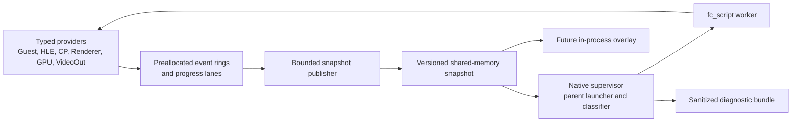

# Native Runtime Diagnostics Design

**Status:** Accepted after architecture review.

**Scope:** The first bounded subproject of the broader compatibility and
modularization program. This specification covers passive hang detection,
causal snapshots, and the native supervisor contract. It deliberately does not
claim arbitrary C++ hot reload or visual correctness for a private workload.

## Objective

Make a Kyty freeze diagnosable without changing guest-visible behavior. When
progress stops, developers should be able to answer:

1. Which execution domain stopped first?
2. What operation or wait was active?
3. Which producer was expected to make progress?
4. Did guest CPU, command processing, GPU completion, flips, or presentation
   continue independently?
5. Which bounded events and thread states led to the stall?

The diagnostic path must remain useful when the emulator process is deadlocked
or crashes. It must be automatable by developers and agents without parsing
unbounded console output.

## Evidence and constraints

- Kyty currently has isolated diagnostics such as fault logging, profiling,
  command-buffer dumps, shader dumps, and bounded `WaitRegMem` failures, but no
  common progress model or snapshot bundle.
- Some renderer fence waits, VideoOut waits, and swapchain operations are
  unbounded. The first version observes them; it does not change their guest or
  Vulkan semantics.
- The emulator is linked as a static library into `fc_script`. There is no
  stable module ABI, quiescence protocol, object-state migration, or code-reload
  boundary.
- The active compatibility work contains timing-sensitive GPU probes. The new
  hot path therefore performs no allocation, formatting, file I/O, locking on
  emulator-owned mutexes, scheduler pumping, or recovery action.
- Raw guest roots, workload identifiers, binaries, memory, textures, and
  screenshots are private and must not enter automatic bundles.
- Kyty is MIT-licensed. GPL projects may inform concepts and tests, but their
  implementation code must not be copied or translated line by line.

## Non-goals for version 1

- Do not wake guest threads, set event flags, fabricate GPU labels, skip
  commands, or make waits succeed.
- Do not terminate the emulator automatically when a stall is detected.
- Do not suspend arbitrary threads to collect state.
- Do not replace RenderDoc, Vulkan validation, or easy_profiler.
- Do not add a polished overlay yet. The overlay will consume the same stable
  snapshot API in a later subproject.
- Do not implement arbitrary native C++ hot reload.
- Do not begin broad graphics or kernel file extraction while the current
  visual frontier is unresolved.

## Considered architectures

### In-process recorder and overlay only

This is the smallest implementation and gives immediate access to renderer
state. It cannot reliably diagnose allocator, loader, global-lock, or hard
process failures because the diagnostic UI and bundle writer die with the
emulator.

### Native recorder plus parent supervisor

This is the selected design. A minimal data plane inside `fc_script` publishes
fixed-size events and progress counters to versioned shared memory. The native
supervisor creates that transport, launches `fc_script` as its child, classifies
repeated samples, observes the child exit status, and writes the evidence
bundle. The emulator remains the authority for cooperative state; the parent
retains the last coherent publication when the child hangs or exits.

### Reloadable C-ABI emulator modules

A versioned C dispatch table could eventually reload narrow, stateless HLE
services after active calls drain. It cannot safely replace the scheduler,
guest memory, resource tracker, renderer, or live Vulkan ownership. This is a
future architecture project rather than a foundation for stall diagnostics.

## Architecture



Dependency direction is one-way:

- Providers depend only on the telemetry recording interface.
- Telemetry does not include or depend on graphics, kernel, UI, filesystem, or
  platform implementation headers.
- The classifier consumes validated local snapshot copies and never calls
  providers.
- The future overlay consumes snapshots; providers never depend on UI.
- Version 1 does not attach to arbitrary processes, suspend threads, or inspect
  live stacks. It uses cooperative evidence and the child process status.

## Module boundaries

The implementation will introduce focused modules under these ownership
boundaries:

```text
source/lib/DevTools/include/Kyty/DevTools/
  Telemetry/Event.h             fixed event schema and identifiers
  Telemetry/EventRing.h         single-writer bounded ring contract
  Telemetry/Progress.h          progress-lane state and immutable snapshots
  Diagnostics/StallClassifier.h pure classification interface
  Transport/Protocol.h          versioned shared-memory layout

source/lib/DevTools/src/
  Telemetry/EventRing.cpp
  Telemetry/Progress.cpp
  Diagnostics/StallClassifier.cpp
  Transport/Protocol.cpp

source/emulator/include/Emulator/DevTools/
  Runtime.h                     process-local lifecycle and registration
  Providers.h                   narrow emulator provider contracts

source/emulator/src/DevTools/
  Runtime.cpp
  SharedMemoryTransport.cpp
  Providers/KernelProvider.cpp
  Providers/GraphicsProvider.cpp
  Providers/VideoOutProvider.cpp

source/devtools/
  CMakeLists.txt
  Supervisor.cpp                parent launcher and sampling loop
  BundleWriter.cpp              sanitized JSON/binary artifacts
  ProcessLauncherPosix.cpp      inherited transport and child status
  ProcessLauncherWindows.cpp
```

`kyty_devtools_core` owns the protocol, rings, snapshots, and pure classifier.
It depends only on portable C++17 facilities and can be linked by both the
static emulator library and the supervisor without pulling emulator, SDL, or
Vulkan state into the tool. Provider files are adapters, not new owners of
kernel or graphics semantics. They translate existing state into telemetry
records through narrow functions.

The current emulator CMake glob does not discover nested source directories.
`source/lib/CMakeLists.txt` will add `DevTools`, and `source/CMakeLists.txt` will
add `devtools`. Their own `CMakeLists.txt` files enumerate sources explicitly.
The dependency graph is `emulator -> kyty_devtools_core` and
`kyty_devtools -> kyty_devtools_core`; the `kyty_devtools` executable never
links the full `emulator` static library. The emulator target enumerates its
provider/runtime sources with `target_sources`, and each launcher adapter is
selected only on its supported host. The change does not broaden existing
globs recursively.

The current `KytyGitVersion` generation will be extended into a generated
`KytyBuildInfo.h` contract containing only the 40-hex revision and dirty flag
captured at build time, not branch names or filesystem paths. The worker
publishes those fixed fields during its handshake; the supervisor never invokes
Git at runtime and never derives provenance from the private launch arguments.

## Event model

Each logical event is a fixed-size plain record containing:

- monotonically increasing sequence number;
- monotonic timestamp;
- host thread identifier;
- domain and event identifiers;
- correlation identifier such as guest thread, submit, frame, fence, or wait;
- four fixed-width numeric payload slots.

The hot path stores numeric identifiers only. Human-readable names are limited
to compiled, allowlisted host-role and event dictionaries owned by the bundle
writer; guest-provided names are not copied. Thread, shader, pipeline, object,
and wait correlations use session-local opaque IDs instead of stable content
hashes or raw host pointers. Each participating thread owns
a preallocated single-producer/single-consumer ring. The producer exclusively
writes `write_sequence`; the publisher exclusively writes `read_sequence`.
Both are aligned atomic counters. To publish a record, the producer:

1. loads `read_sequence` with acquire semantics;
2. drops the new event and increments its loss counter when
   `write_sequence - read_sequence == capacity`;
3. otherwise writes the plain record into its exclusively owned free slot; and
4. stores the next `write_sequence` with release semantics.

The publisher acquires `write_sequence`, copies only fully published records,
then release-stores the advanced `read_sequence`. A slot is never overwritten
until the consumer has released it, so producer and consumer never access its
plain payload concurrently. An interrupted producer that has not completed the
release publication leaves no visible record. The version 1 ring deliberately
drops the newest event when full instead of overwriting unread history.
On every drop, the producer updates writer-owned atomic total-loss,
last-attempted-sequence, and last-loss-monotonic-time fields. Equivalent global
metadata covers unregistered writers and registration-capacity loss. The
producer stores sequence/time first with relaxed operations, then release-stores
the new total-loss value; the publisher acquire-loads a changed total before
reading sequence/time. Global multi-producer loss uses an atomic counter and
atomic maximum timestamp but does not claim an exact sequence. This lets the
classifier determine whether an evidence window contains a gap, rather than
merely knowing that some loss occurred earlier in the process.

Threads record through an opaque `TelemetryWriterToken`. Kyty-owned threads
register explicitly at main guest entry, `Pthread.cpp::run_thread`, or their
existing host-thread creation boundary before instrumented work begins. The
token is retained in existing private thread context; no guest `thread_local`
storage is required. Registration slots follow `Free -> Reserved -> Active ->
Closing -> Free`. Registration may reserve only a `Free` slot, increments its
generation before activation, and initializes indices before release-publishing
`Active`. On thread exit the sole producer publishes its exit event, release-
stores `Closing`, and never writes that slot again. The publisher acquire-loads
`Closing`, drains through the last published `write_sequence`, and alone returns
the slot to `Free`. No indices or plain records are reset while the publisher can
still read them. A missing orderly exit leaves the slot unavailable rather than
reusing it unsafely, and a stale token must match both generation and `Active`
state before recording. There is no first-use thread-ID lookup, locking, or
registration on the hot path. An
unregistered or foreign thread drops the event and increments one lock-free
process counter. The snapshot reports ring loss, registration-capacity loss,
and unregistered-writer loss separately.

## Progress lanes

The detector uses independent submitted/completed epochs rather than one
global heartbeat:

| Lane | Submitted operation | Completion evidence |
| --- | --- | --- |
| Guest-thread execution | thread starts or crosses an instrumented execution boundary | a later boundary, explicit wait, return, or exit is observed |
| HLE | call entered | call returned with result category |
| Command processor | submit and PM4 packet | packet offset or submit completion advances |
| Renderer | frame/draw/dispatch recording | command buffer submitted |
| GPU queue | queue submission/timeline value | fence or timeline completion advances |
| VideoOut | flip requested | flip completion callback/event |
| Presentation | image acquired/blit submitted | present result recorded |
| Synchronization | wait started | predicate, signal, timeout, or cancellation |

Progress is a fixed-capacity table of keyed instances, not one singleton per
domain. Every instance exposes its last-change timestamp, current operation,
correlation identifier, and latest submitted/completed values. Initial keys are
guest thread slot/generation, HLE thread plus call depth, command engine/ring,
renderer context, GPU queue, VideoOut handle, swapchain generation, and explicit
waiter slot. A healthy instance cannot overwrite a stalled peer. Capacity
exhaustion increments a per-domain incompleteness counter and prevents any
classification that depends on that domain from receiving high confidence.
A presentation heartbeat therefore cannot mask a stuck command processor, and
a busy guest thread cannot mask a GPU backlog.

Kyty does not currently have a general guest scheduler or universal safepoint.
The guest-thread lane reports only guest entry/exit, HLE boundaries, pthread
lifecycle, and explicit wait transitions that existing paths actually observe.
It does not sample arbitrary RIP values or infer a complete runnable set from
missing instrumentation. Each keyed endpoint has one declared writer;
submitted and completed state owned by different threads use separate
endpoints.

A dedicated publication thread drains the local rings and copies the current
bounded model into shared memory. Each protocol section has two fixed-size data
buffers, a monotonically increasing 64-bit generation, one aligned atomic
active descriptor `{buffer_index, generation}`, and one aligned atomic reader
count per buffer. Version 1 deliberately uses sequentially consistent operations
for every shared active-descriptor and reader-count access; publication occurs
only four times per second, so weaker-order optimization has no value here.

The reader loads the active descriptor, increments that buffer's reader count,
then reloads the descriptor. If the packed descriptor changed, it decrements
the count and retries. Only a matching index and generation permits the plain
payload copy. After validating section schema, declared size, and checksum, the
reader decrements the count. The sole publisher loads the active descriptor,
selects the other buffer, and writes it only after a sequentially consistent
reader-count load returns zero. It then publishes a strictly newer packed
descriptor. A late reader that pinned an old active buffer must observe a
generation mismatch on its second descriptor load and never touches that
payload. A reader that already passed validation is visible in the count before
the publisher can reuse its inactive buffer. If the count is nonzero, the
publisher skips that publication rather than blocking. Generation prevents ABA
acceptance.

The wire format defines little-endian 64-bit hosts, fixed byte offsets, field
widths, alignments, capacities, and section sizes. It never maps a compiler
dependent C++ struct or `std::atomic` layout across processes. Shared atomic
words are accessed through platform adapters (`__atomic` operations on POSIX,
`Interlocked` operations on Windows) whose width, alignment, and lock-free
behavior are build- and runtime-validated. A supervisor snapshot is immutable
only after this protocol has produced a validated local copy. If a section
cannot be copied after bounded retries, the sample marks it unavailable and
classification confidence is reduced.

## Wait causality

Wait events describe the contract rather than only a stack address:

- waiter identity;
- wait kind and object/address identity;
- predicate/reference/mask where applicable;
- bounded or indefinite deadline;
- expected producer domain and correlation identifier when known;
- observed last value and last producer event.

The first version builds a best-effort wait graph from explicit relationships.
Unknown producers remain unknown; the tool must not invent ownership. A graph
cycle is strong deadlock evidence. Absence of a known producer is reported as a
fact with lower confidence, not promoted automatically to deadlock.

## Stall classification

The supervisor samples coherently published progress sections at 250 ms
intervals. Thresholds are developer-tool settings and do not affect emulator
waits:

- `suspected_after`: 5 seconds without relevant progress;
- `confirmed_after`: 15 seconds with the same causal state;
- per-lane overrides are allowed for known long-running host operations.

Classification is pure and returns a category, confidence, evidence list, and
contradicting facts:

- `HealthyIdle`: every registered and observable guest-thread instance has an
  explicit idle or wait state, no required domain reports incomplete coverage,
  waits have plausible producers or deadlines, and GPU submissions are caught
  up. Missing inventory yields `UnknownStall`, never healthy idle.
- `HleStall`: one HLE call remains entered while its guest thread and dependent
  lanes cannot advance.
- `GuestDeadlock`: an explicit wait-graph cycle exists among registered
  instances. “Every thread appears blocked” without a proven complete inventory
  is not promoted to deadlock.
- `CommandProcessorStall`: the same submit and PM4 offset remain active while
  upstream work exists.
- `GpuStall`: submitted GPU work remains outstanding across repeated samples
  while host submission is healthy.
- `PresentationStall`: GPU completion advances but flips or presents stop.
- `WorkerUnresponsive`: the worker process remains alive but its publication
  heartbeat stops; the result states which last coherent sections were old.
- `ProcessExited`: the child exits normally and its exit code is recorded.
- `ProcessCrashed`: the child exits by signal, unhandled exception, abort, or
  another platform-defined abnormal status.
- `UnknownStall`: the evidence proves lack of progress but not a single cause.

A domain-loss timestamp or any unregistered-writer, registration-capacity,
keyed-instance-capacity, skipped-publication, or rejected-sample counter delta
inside the decisive evidence interval is an explicit gap. Any classification
that depends on the affected domain is capped below high confidence; “the loss
is explained” does not waive this rule. The result includes counter deltas plus
the last attempted sequence and monotonic loss time where the producer can
publish them.

Version 1 does not claim general guest livelock detection. Repeated observable
boundaries may be reported as a low-confidence fact, but not as a cause or a
complete instruction-progress assessment.

The first suspected sample preserves a lightweight snapshot. Confirmation
requires repeated agreement and then emits one bundle plus a notification.
Default action is capture only.

## Diagnostic bundle

The supervisor writes a temporary bundle directory, flushes each artifact,
writes the completion manifest last, and renames the directory on the same
filesystem. Readers accept only a matching completion marker and manifest. The
completed bundle contains:

- `manifest.json`: schema version, build revision and dirty flag, host platform,
  allowlisted GPU capabilities, logging-mode enum, validation-enabled boolean,
  resolution width/height, shader-cache-state enum, trigger, monotonic times,
  protocol loss/incompleteness counters, and artifact checksums;
- `progress.json`: lane epochs, ages, current operations, classifier reasoning,
  confidence, and contradictions;
- `threads.json`: cooperative session-local identifiers, allowlisted host-role
  enum, state, wait reason, last HLE call, and available allowlisted cooperative
  register/stack metadata;
- `wait_graph.json`: waiter, object, and evidenced producer relationships;
- `gpu.json`: queue, submit, PM4 offset/opcode, frame/draw, session-local
  shader/pipeline IDs, and submitted/completed synchronization values;
- `timeline.bin`: bounded raw event records and dictionary version;

The automatic shareable bundle is structured and allowlist-only. It never
copies arbitrary command lines, environment values, log strings, paths, guest
roots, workload identifiers, full guest memory, guest binaries, textures, or
screenshots. Raw emulator/Vulkan log tails, OS crash dumps, and vendor fault
artifacts may be copied only by an explicit separate local-only action. Those
attachments are never part of the automatic bundle, are marked non-shareable,
and require developer inspection before manual export.

## Supervisor lifecycle and shared-memory protocol

Version 1 uses the supervisor only as a parent launcher:

1. `kyty_devtools run -- <worker> <arguments...>` creates an anonymous or
   immediately unlinked user-private mapping and a random 128-bit nonce.
2. POSIX launches inherit only the mapping descriptor required by the worker;
   Windows launches inherit a duplicated restricted handle. The child receives
   the descriptor/handle number and nonce through dedicated transport fields,
   not a globally discoverable mapping name.
3. The worker validates magic, protocol major, total size, nonce, parent
   identity, and transport permissions before publishing its PID, parent PID,
   build info, start token, and capabilities. The parent validates the child
   process handle plus PID/start token before accepting the handshake.
4. A bounded handshake timeout reports `WorkerHandshakeFailed`; it never changes
   worker semantics or guesses a protocol.
5. The parent owns the mapping and bundle temporary directory, waits for the
   child status, and retains the last coherent publication after normal exit,
   crash, or a live-process heartbeat stop. It forwards ordinary console and
   termination signals without automatically terminating on a stall.
6. Mapping permissions are owner-only (`0600` on POSIX and a user-restricted
   DACL on Windows). Anonymous/inherited handles avoid stale named instances;
   incomplete bundle directories are cleaned only when owner identity and an
   age policy both match.

`fc_script` remains runnable without the launcher. In that mode transport is
disabled unless a valid inherited descriptor/handle is present, and emulation
does not wait for a supervisor. Attach-to-running-process mode is deferred.

The protocol begins with magic, major/minor version, total size, process
identity, start token, nonce proof, capabilities, publication heartbeat, and
generation. Every section has a fixed protocol offset, declared size, fixed
capacity, and schema identifier; no process pointers cross the boundary.

### Version 1 wire layout

The first protocol supports little-endian 64-bit Linux, macOS, and Windows. It
uses a `0x141000`-byte mapping with these fixed regions:

| Offset | Size | Region |
| --- | --- | --- |
| `0x000000` | `0x001000` | protocol header and section descriptors |
| `0x001000` | `0x020000` | progress buffer 0 |
| `0x021000` | `0x020000` | progress buffer 1 |
| `0x041000` | `0x080000` | timeline buffer 0 |
| `0x0c1000` | `0x080000` | timeline buffer 1 |

The non-atomic header prefix uses fixed-width little-endian fields: magic at
`0x000`, major/minor at `0x008/0x00a`, header size at `0x00c`, total size at
`0x010`, byte-order and word-size tags at `0x018/0x01c`, the 16-byte nonce at
`0x020`, parent/child identities at `0x030/0x038`, and the child start token at
`0x040`. The allowlisted descriptor block stores the 40-byte ASCII hex revision
at `0x080`, dirty flag at `0x0a8`, 128 capability bits at `0x0b0`, logging and
shader-cache enums at `0x0c0/0x0c4`, validation flag at `0x0c8`, and resolution
width/height at `0x0cc/0x0d0`; unused bytes are zero and reserved.
The parent initializes its fields before launch. The child writes its immutable
identity/build fields, then release-stores the ready handshake state; the parent
reads those fields only after acquiring that state. Neither side mutates the
non-atomic prefix after the handshake.

Every shared atomic control word occupies the first eight bytes of its own
64-byte-aligned cell: handshake state at `0x100`, publication heartbeat at
`0x140`, progress active descriptor at `0x180`, progress reader counts at
`0x1c0/0x200`, timeline active descriptor at `0x240`, timeline reader counts at
`0x280/0x2c0`, then ring loss, unregistered-writer loss, registration-capacity
loss, instance-capacity loss, skipped publications, disconnects, and rejected
samples at `0x300/0x340/0x380/0x3c0/0x400/0x440/0x480`. Handshake values are
`0=Uninitialized`, `1=ParentReady`, `2=WorkerReady`, `3=WorkerClosing`, and
`4=WorkerRejected`. The active descriptor packs buffer index in bit 0 and a
nonzero generation in bits 1..63; only the publisher writes it, and a worker
must stop transport publication before generation `2^63` would wrap.

Two 32-byte section descriptors at `0x600` and `0x620` contain schema ID and
flags at `0x00/0x04`, buffer offsets at `0x08/0x10`, buffer size at `0x18`, and
item capacity at `0x1c`. They must exactly repeat the fixed layout above or the
reader rejects the mapping.

Each data buffer begins with a 64-byte section header: schema ID at `0x00`,
payload size at `0x04`, generation at `0x08`, item count at `0x10`, flags at
`0x14`, and CRC-64/ECMA-182 of the declared payload at `0x18` (polynomial
`0x42f0e1eba9ea3693`, initial value `0`, no reflection, final XOR `0`); the
remainder is zero and reserved. A timeline event is exactly 72 bytes: sequence
at `0x00`, monotonic
timestamp at `0x08`, writer key at `0x10`, domain/event/flags at
`0x18/0x1a/0x1c`, correlation at `0x20`, and four 64-bit payload values at
`0x28..0x47`. The shared timeline holds at most 4,096 newest drained events.

A progress item is exactly 64 bytes: instance key at `0x00`, last-change time at
`0x08`, submitted/completed epochs at `0x10/0x18`, operation at `0x20`,
state/flags at `0x24/0x26`, correlation at `0x28`, and auxiliary values at
`0x30/0x38`. The progress payload starts with a 512-byte table header containing
eight 24-byte domain descriptors at `0x000`. Each descriptor contains domain
and record size at
`0x00/0x02`, record-array offset at `0x04`, capacity/count at `0x08/0x0c`, and
the domain incompleteness counter at `0x10`. Eight 24-byte domain loss summaries
at header offset `0x100` contain total loss, last attempted sequence, and last
loss monotonic time as three 64-bit values. Record arrays follow header offset
`0x200` at fixed offsets in domain order with capacities of 256 guest threads,
512 nested HLE calls, 32 command-engine rings, 32 renderer contexts, 32 GPU
queues, 64 VideoOut handles, 16 swapchain generations, and 512 explicit waits.
The process-local recorder supports 256 registered writers with 256 events per
SPSC ring. All capacities, offsets, and record sizes are compile-time constants
mirrored by protocol validation tests.

Ring indices are unsigned 64-bit sequences and capacity is a power of two below
`2^63`. Because outstanding distance never exceeds capacity, modular unsigned
subtraction remains unambiguous across counter wrap; wraparound is covered by a
focused test. A new registration generation invalidates all prior indices for
that writer slot only after the publisher has completed the `Closing -> Free`
handoff described above.

Shared control words use explicitly aligned fixed-width atomics that are proven
always lock-free for the active compiler/architecture. Build-time assertions
protect supported targets and runtime capability negotiation protects the
mapped protocol. A target that cannot satisfy this contract keeps in-process
recording available but refuses the supervisor transport; it does not silently
substitute process-local locks in shared memory.

- Major-version mismatch is rejected with a clear diagnostic.
- Minor versions may append capability-gated sections.
- The emulator remains functional when no supervisor connects.
- A supervisor disconnect increments a counter but never blocks emulation.
- Version 1 has no supervisor-to-worker command queue. `capture-now` and
  notification acknowledgement are supervisor-local, and telemetry filters are
  immutable startup configuration. A future control plane requires its own
  safepoint design and specification.

## Future native UI and hot reload boundary

A later overlay will use official MIT-licensed Dear ImGui through an adapter in
`DevTools/Overlay`. It will display validated snapshot copies; it will not read
mutable renderer or kernel globals directly. Any bidirectional commands require
a later safepoint/control-plane specification.

Live updates are divided honestly:

- Version 1 telemetry filters are selected at worker startup. A later overlay
  may atomically replace UI-only settings.
- Debug visualization controls can apply at frame boundaries.
- Host or explicitly keyed guest shader overrides can later use
  compile/validate, new module and pipeline generation, atomic publication, and
  fence/timeline retirement of the old generation. Failure keeps the previous
  generation active.
- Physical-device selection, queues, enabled Vulkan features, resolution modes
  requiring swapchain recreation, shader translator C++, scheduler, memory,
  renderer objects, and general C++ changes require rebuild and controlled
  restart/replay.
- A future C-ABI plugin may cover only stateless or quiescent HLE services with
  opaque handles, versioned function tables, active-call draining, and explicit
  state migration.

The supervisor owns the dependable developer loop for general code changes:
build a new worker, stop at a controlled boundary, restart, and replay a local
untracked reproduction. This is the native equivalent that is safe for the
current architecture; it is not presented as Vite-style state-preserving C++
replacement.

## Failure handling

- Ring overflow is observable and does not block producers.
- Snapshot serialization occurs in the supervisor, not an emulator hot path.
- If shared memory cannot be created, the emulator reports one structured
  initialization error and continues with diagnostics disabled.
- A protocol mismatch disables the connection rather than guessing a layout.
- Child-status decoding failure is recorded without discarding the last
  coherent portable evidence.
- If Vulkan reports device loss and `VK_EXT_device_fault` is available, device
  fault information is collected only through the valid post-device-loss path.
- Unknown classifications remain structured `UnknownStall` results with the
  evidence required for the next provider, not generic success.

## Meaningful verification

Tests protect contracts rather than UI details:

1. SPSC full/drop behavior, slot reuse only after release, interrupted producer,
   sequence wrap policy, and exact loss accounting. A high-contention stress
   test runs under ThreadSanitizer on supported CI hosts.
2. Explicit lifecycle registration, `Active -> Closing -> drained -> Free`
   handoff, stale-token generation rejection, abrupt-exit non-reuse,
   unregistered-writer loss, keyed-instance concurrency, and capacity
   exhaustion lowering classification confidence.
3. Shared-section reader pinning, generation/ABA rejection, inactive-buffer
   reuse, checksum and bounds rejection, bounded retry/skip behavior, and an
   interrupted publisher preserving the prior active snapshot. The process-
   local protocol model also runs under ThreadSanitizer.
4. Virtual-time classifications for complete healthy idle, HLE stall, explicit
   wait cycle, CP stall, GPU backlog, presentation stall, worker unresponsive,
   normal exit, abnormal exit, and unknown/incomplete evidence.
5. Evidence contradictions or incomplete domain coverage prevent a high-
   confidence false classification.
6. Protocol major/minor compatibility, fixed offsets/sizes, handshake identity,
   nonce mismatch, permission failure, disconnect, and child-status decoding.
7. Bundle schema, per-artifact checksum, completion marker last, incomplete-
   directory rejection, and byte-for-byte privacy scans. Canary secrets placed
   in worker argv, environment, paths, and raw logs must not appear in any
   automatic artifact.
8. Provider characterization tests only where a current operation already has
   deterministic state suitable for a test.
9. Synthetic launcher tests cover: one blocked registered lane while the
   publisher remains alive; a worker whose publication thread and work lanes
   all stop while the process stays alive; normal exit; and abrupt abnormal
   exit. The parent must finalize from the last coherent state without private
   fixtures or wall-clock sleeps in classification tests.
10. Linux, macOS, and Windows build jobs compile the supported transport and
    launcher adapters. Runtime integration executes on hosts available to CI.

No tests assert cosmetic overlay layout, CSS-like properties, or timing based
on wall-clock sleeps.

Performance validation is reported separately from deterministic tests. A
fixed synthetic workload records enabled/disabled CPU cost and event throughput
after warmup. The private strict workload is reproduced twice with telemetry
disabled and twice enabled under the same resolution, logging mode, shader-cache
state, and input sequence; median and p95 frame time plus process CPU are
recorded. An enabled regression above 3% that also exceeds the disabled
run-to-run variation blocks acceptance until explained. Both modes must reach
the same strict/visual frontier, and all loss/capacity counters are reported.

## Delivery sequence

1. Preserve and reconcile the dirty graphics work; validate the clean
   compositor candidate and create a curated integration history without
   fabricated behavior or `Co-authored-by` trailers before `main`.
2. Implement event records, per-thread rings, progress lanes, and pure virtual-
   time classification.
3. Add versioned shared memory, the native supervisor, and sanitized bundle
   writer.
4. Instrument one domain at a time: existing waits, guest/HLE, command
   processor, renderer/GPU, then VideoOut/presentation. Each commit must build,
   pass focused tests, and preserve the strict frontier.
5. Use the tool to capture the current visual/rendering frontier without
   changing guest behavior; fix one evidenced producer at a time.
6. Add the overlay and shader-generation reload as separate specifications and
   commits after the telemetry contract is stable.
7. Freeze reproducible, correctly rendered gameplay before broad module
   extraction. Then modularize one behavior-neutral seam per commit.
8. After the primary workload passes the full gate, advance the next private
   workload first, followed by the remaining two, recapturing each title's own
   first strict frontier.

## Acceptance criteria for this subproject

- A synthetic stopped lane produces one deterministic, sanitized bundle whose
  classification explains the decisive and contradicting evidence.
- A blocked lane with a live publisher, a whole worker whose publication stops
  while the process remains alive, a normal exit, and an abrupt abnormal exit
  each produce the correct distinct result. For a whole-worker stop, diagnosis
  is explicitly based on the last coherently published state plus the stale
  heartbeat; it does not claim fresh thread state.
- Telemetry disabled and enabled runs preserve focused test results, the same
  strict/visual frontier in two reproductions per mode, and the performance gate
  defined above.
- Recording does not allocate or write files on instrumented hot paths.
- The detector performs no scheduler pumping, guest signaling, fabricated GPU
  completion, or automatic termination.
- No automatic artifact contains a private root, workload identifier, guest
  binary, texture, screenshot, or full memory dump.
- Ring loss, unregistered-writer loss, instance-capacity exhaustion, snapshot
  retries, and skipped publications are visible and are zero or explicitly
  explained in acceptance evidence.
- The native API and shared-memory protocol are documented sufficiently for the
  future overlay and automation clients to consume without private headers.
