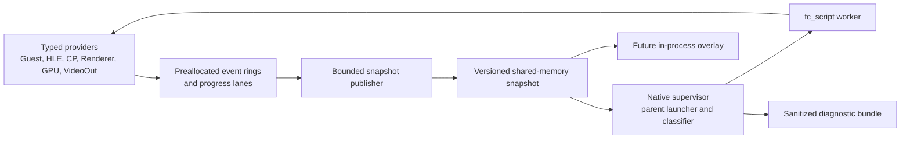

# Native Runtime Diagnostics Design

**Status:** Accepted after architecture review.

**Scope:** The first bounded subproject of the broader compatibility and
modularization program. This specification covers passive hang detection,
causal snapshots, and the native supervisor contract. It deliberately does not
claim arbitrary C++ hot reload or visual correctness for a private workload.

## Objective

Make a Kyty freeze diagnosable without changing guest-visible behavior. When
progress stops, developers should be able to answer:

1. Which execution domain stopped first?
2. What operation or wait was active?
3. Which producer was expected to make progress?
4. Did guest CPU, command processing, GPU completion, flips, or presentation
   continue independently?
5. Which bounded events and thread states led to the stall?

The diagnostic path must remain useful when the emulator process is deadlocked
or crashes. It must be automatable by developers and agents without parsing
unbounded console output.

## Evidence and constraints

- Kyty currently has isolated diagnostics such as fault logging, profiling,
  command-buffer dumps, shader dumps, and bounded `WaitRegMem` failures, but no
  common progress model or snapshot bundle.
- Some renderer fence waits, VideoOut waits, and swapchain operations are
  unbounded. The first version observes them; it does not change their guest or
  Vulkan semantics.
- The emulator is linked as a static library into `fc_script`. There is no
  stable module ABI, quiescence protocol, object-state migration, or code-reload
  boundary.
- The active compatibility work contains timing-sensitive GPU probes. The new
  hot path therefore performs no allocation, formatting, file I/O, locking on
  emulator-owned mutexes, scheduler pumping, or recovery action.
- Raw guest roots, workload identifiers, binaries, memory, textures, and
  screenshots are private and must not enter automatic bundles.
- Kyty is MIT-licensed. GPL projects may inform concepts and tests, but their
  implementation code must not be copied or translated line by line.
- Primary-source review on 2026-07-14 found external reference PR 164 still open as one
  broad compatibility commit spanning scheduler, memory, GPU, and HLE. Its own
  report says a TLS scheduler pump helps one class of workload but can stall
  another, so it is evidence against coupling a watchdog to recovery behavior,
  not a patch unit for Kyty. The same pull-request index separates MRT and
  packed-f16 work into PRs 149 and 145; the curated plan likewise treats those
  as independent red/green contracts. See
  <https://github.com/par274/external reference/pull/164> and
  <https://github.com/par274/external reference/pulls>.

## Non-goals for version 1

- Do not wake guest threads, set event flags, fabricate GPU labels, skip
  commands, or make waits succeed.
- Do not terminate the emulator automatically when a stall is detected.
- Do not suspend arbitrary threads to collect state.
- Do not replace RenderDoc, Vulkan validation, or easy_profiler.
- Do not add a polished overlay yet. The overlay will consume the same stable
  snapshot API in a later subproject.
- Do not implement arbitrary native C++ hot reload.
- Do not begin broad graphics or kernel file extraction while the current
  visual frontier is unresolved.

## Considered architectures

### In-process recorder and overlay only

This is the smallest implementation and gives immediate access to renderer
state. It cannot reliably diagnose allocator, loader, global-lock, or hard
process failures because the diagnostic UI and bundle writer die with the
emulator.

### Native recorder plus parent supervisor

This is the selected design. A minimal data plane inside `fc_script` publishes
fixed-size events and progress counters to versioned shared memory. The native
supervisor creates that transport, launches `fc_script` as its child, classifies
repeated samples, observes the child exit status, and writes the evidence
bundle. The emulator remains the authority for cooperative state; the parent
retains the last coherent publication when the child hangs or exits.

### Reloadable C-ABI emulator modules

A versioned C dispatch table could eventually reload narrow, stateless HLE
services after active calls drain. It cannot safely replace the scheduler,
guest memory, resource tracker, renderer, or live Vulkan ownership. This is a
future architecture project rather than a foundation for stall diagnostics.

## Architecture



Dependency direction is one-way:

- Providers depend only on the telemetry recording interface.
- Telemetry does not include or depend on graphics, kernel, UI, filesystem, or
  platform implementation headers.
- The classifier consumes validated local snapshot copies and never calls
  providers.
- The future overlay consumes snapshots; providers never depend on UI.
- Version 1 does not attach to arbitrary processes, suspend threads, or inspect
  live stacks. It uses cooperative evidence and the child process status.

## Module boundaries

The implementation will introduce focused modules under these ownership
boundaries:

```text
source/lib/DevTools/include/Kyty/DevTools/
  Telemetry/Event.h             fixed event schema and identifiers
  Telemetry/EventRing.h         single-writer bounded ring contract
  Telemetry/Progress.h          progress-lane state and immutable snapshots
  Diagnostics/StallClassifier.h pure classification interface
  Transport/Protocol.h          versioned shared-memory layout

source/lib/DevTools/src/
  Telemetry/EventRing.cpp
  Telemetry/Progress.cpp
  Diagnostics/StallClassifier.cpp
  Transport/Protocol.cpp

source/emulator/include/Emulator/DevTools/
  Runtime.h                     process-local lifecycle and registration
  Providers.h                   narrow emulator provider contracts

source/emulator/src/DevTools/
  Runtime.cpp
  SharedMemoryTransport.cpp
  Providers/KernelProvider.cpp
  Providers/GraphicsProvider.cpp
  Providers/VideoOutProvider.cpp

source/devtools/
  CMakeLists.txt
  Supervisor.cpp                parent launcher and sampling loop
  BundleWriter.cpp              sanitized JSON/binary artifacts
  ProcessLauncherPosix.cpp      inherited transport and child status
  ProcessLauncherWindows.cpp
```

`kyty_devtools_core` owns the protocol, rings, snapshots, and pure classifier.
It depends only on portable C++17 facilities and can be linked by both the
static emulator library and the supervisor without pulling emulator, SDL, or
Vulkan state into the tool. Provider files are adapters, not new owners of
kernel or graphics semantics. They translate existing state into telemetry
records through narrow functions.

The current emulator CMake glob does not discover nested source directories.
`source/lib/CMakeLists.txt` will add `DevTools`, and `source/CMakeLists.txt` will
add `devtools`. Their own `CMakeLists.txt` files enumerate sources explicitly.
The dependency graph is `emulator -> kyty_devtools_core` and
`kyty_devtools -> kyty_devtools_core`; the `kyty_devtools` executable never
links the full `emulator` static library. The emulator target enumerates its
provider/runtime sources with `target_sources`, and each launcher adapter is
selected only on its supported host. The change does not broaden existing
globs recursively.

The current `KytyGitVersion` generation will be extended into a generated
`KytyBuildInfo.h` contract containing only the 40-hex revision and dirty flag
captured at build time, not branch names or filesystem paths. The worker
publishes those fixed fields during its handshake; the supervisor never invokes
Git at runtime and never derives provenance from the private launch arguments.

## Common monotonic timebase

Every worker timestamp, supervisor sample time, heartbeat, deadline, and loss
time uses the same platform clock adapter in both binaries. Linux and macOS use
`clock_gettime(CLOCK_MONOTONIC)` and checked seconds/nanoseconds conversion.
Windows uses `QueryPerformanceCounter` with `QueryPerformanceFrequency`; the
conversion splits quotient/remainder and uses checked wide multiplication so it
cannot overflow before producing nanoseconds. `std::chrono::steady_clock` is
not used for cross-process values because its epoch is not a protocol contract.
Production clock failure is a structured diagnostics failure, never a
wall-clock fallback. Tests may inject a fake clock only through the explicit
clock seam.

The two processes therefore compare absolute values from one host monotonic
epoch. Classifier age is `sample_ns - event_ns` only after checked ordering;
future values or subtraction overflow invalidate the sample. Suspend behavior
follows the selected platform monotonic primitive consistently and is recorded
as part of the host platform contract.

## Event model

Each logical event is a fixed-size plain record containing:

- monotonically increasing sequence number;
- monotonic timestamp;
- opaque writer key (slot plus generation), never a raw host thread identifier;
- domain and event identifiers;
- correlation identifier such as guest thread, submit, frame, fence, or wait;
- four fixed-width numeric payload slots.

The hot path stores numeric identifiers only. Human-readable names are limited
to compiled, allowlisted host-role and event dictionaries owned by the bundle
writer; guest-provided names are not copied. Thread, shader, pipeline, object,
and wait correlations use session-local opaque IDs instead of stable content
hashes or raw host pointers. Each participating thread owns
a preallocated single-producer/single-consumer ring. The producer exclusively
writes `write_sequence`; the publisher exclusively writes `read_sequence`.
Both are aligned atomic counters. To publish a record, the producer:

1. loads `read_sequence` with acquire semantics;
2. drops the new event and increments its loss counter when
   `write_sequence - read_sequence == capacity`;
3. otherwise writes the plain record into its exclusively owned free slot; and
4. stores the next `write_sequence` with release semantics.

The publisher acquires `write_sequence`, copies only fully published records,
then release-stores the advanced `read_sequence`. A slot is never overwritten
until the consumer has released it, so producer and consumer never access its
plain payload concurrently. An interrupted producer that has not completed the
release publication leaves no visible record. The version 1 ring deliberately
drops the newest event when full instead of overwriting unread history.
The writer registry, not the caller, assigns `EventRecord.sequence` from a
writer-owned attempted-event counter. The counter advances for both published
and dropped attempts, while `write_sequence` advances only for records actually
published into the SPSC ring. A later successful record can therefore expose a
gap without using the ring index as fabricated event ordering. The matching
drop stores that same attempted sequence in its writer loss record. The
registry also overwrites `EventRecord.writer_key` from the validated token's
slot and generation; caller-provided sequence/key values are ignored.
On every drop, the producer updates slot-owned atomic total-loss,
last-attempted-sequence, and last-loss-monotonic-time fields. Equivalent global
metadata covers unregistered writers and registration-capacity loss. The
producer stores sequence/time first with relaxed operations, then release-stores
the new total-loss value; the publisher acquire-loads a changed total before
reading sequence/time. Global multi-producer loss uses an atomic counter and
atomic maximum timestamp but does not claim an exact sequence. The published
snapshot therefore has two distinct fixed records: per-slot writer loss contains
total, last-attempted sequence, and last-loss time; global/domain loss contains
total, a reserved zero word, and last-loss time. This lets the classifier
conservatively determine whether an evidence window contains a slot-specific
gap without fabricating ordering for multi-producer counters. Attempted-event
sequence and loss metadata are monotonic for the process lifetime of a registry
slot and never reset when its generation changes. A retained event from an
older generation therefore cannot have its gap hidden by slot reuse; loss that
cannot be attributed to one retained generation lowers confidence for every
overlapping retained generation of that slot.

Threads record through an opaque `TelemetryWriterToken`. Kyty-owned threads
register explicitly at main guest entry, `Pthread.cpp::run_thread`, or their
existing host-thread creation boundary before instrumented work begins. The
token is retained in existing private thread context; no guest `thread_local`
storage is required. Registration slots follow `Free -> Reserved -> Active ->
Closing -> Free`. Registration may reserve only a `Free` slot, increments its
generation before activation, and initializes indices before release-publishing
`Active`. On thread exit the sole producer publishes its exit event, release-
stores `Closing`, and never writes that slot again. The publisher acquire-loads
`Closing`, drains through the last published `write_sequence`, and alone returns
the slot to `Free`. No indices or plain records are reset while the publisher can
still read them. A missing orderly exit leaves the slot unavailable rather than
reusing it unsafely, and a stale token must match both generation and `Active`
state before recording. There is no first-use thread-ID lookup, locking, or
registration on the hot path. An
unregistered or foreign thread drops the event and increments one lock-free
process counter. The snapshot reports ring loss, registration-capacity loss,
and unregistered-writer loss separately.

Writer-slot generation is 32-bit and never wraps into a previously issued
`WriterKey`: a slot is permanently retired before increment would wrap to zero.
Retirement preserves its process-lifetime attempted sequence and loss history;
capacity accounting reports the reduced registry rather than aliasing a stale
token.

The version 1 timeline dictionary is part of the wire ABI, not C++ declaration
order. Domain values are `Unknown=0`, `GuestThread=1`, `Hle=2`,
`CommandProcessor=3`, `Renderer=4`, `GpuQueue=5`, `VideoOut=6`,
`Presentation=7`, `Synchronization=8`, and `Count=9`. Event values are
`Unknown=0`, `ThreadStart=1`, `ThreadExit=2`, `OperationSubmit=3`,
`OperationProgress=4`, `OperationComplete=5`, `WaitBegin=6`, `WaitEnd=7`, and
`Count=8`. Writers reject `Unknown`, `Count`, and out-of-range values; readers
preserve an unknown future numeric value as structured unsupported data rather
than remapping it. Changing an assigned value requires protocol-version review.
An active writer's invalid domain/event attempt advances its attempted-event
sequence and writer loss record but never enters the ring. Readers never use an
unrecognized numeric value as an array index or classification domain.

Timeline flags are also a closed version-1 dictionary:
`CorrelationValid=0x00000001`, `Payload0Valid=0x00000002`,
`Payload1Valid=0x00000004`, `Payload2Valid=0x00000008`,
`Payload3Valid=0x00000010`, `ResultError=0x00000020`, and
`TimedWait=0x00000040`. All other bits are zero on write. Unsupported future
wire values are reported through reader-owned decode metadata, never by
rewriting `EventRecord.flags`.

The common payload contract is fixed. `ThreadStart` uses correlation as the
thread instance and payload 0 as `ThreadRole`; `ThreadExit` additionally uses
payload 1 as `ResultCategory`. `OperationSubmit`, `OperationProgress`, and
`OperationComplete` use payloads 0/1 as `OperationCode`/epoch; completion uses
payload 2 as `ResultCategory`, and any of the three may use payload 3 for the
operation's first auxiliary value. Wait events use correlation for the owning
GuestThread/CommandProcessor `ProgressRef`. `WaitBegin` payload 0 is the wait
operation. For EventFlag, payload 1 is opaque object ID, payload 2 is optional
deadline, and payload 3 packs the 32-bit requested mask plus the closed
any/all/clear mode in bits 32..33. For Semaphore, payload 1 is object ID,
payload 2 deadline, and payload 3 requested permits. For EventQueue, payload 1
is object ID, payload 2 deadline, and payload 3 is zero; event ident and user
data are forbidden. RegisterMemory waits are untimed: payload 1 is the opaque
observation ID and payloads 2/3 are expected value/mask at the matching 32- or
64-bit width; the address is forbidden. `WaitEnd` uses payloads 0/1/2 as
operation, the same object/observation ID, and `WaitOutcome`, with optional
observed value in payload 3. Unused payloads and validity flags are zero. The
valid dictionaries are:

Thread instances are process-local diagnostics identities allocated before the
native thread create, from one monotonic 56-bit sequence stored in `uint64_t`
and starting at 1. The allocator refuses a new diagnostic registration before
the value would exceed the `ProgressRef` instance field. The
reservation carries that same instance through activation, exit, or abandon;
consumed values are never reused. A pointer, host thread ID, or a guest
`unique_id` assigned after entry is never substituted for this identity.

- `ThreadRole`: `Unknown=0`, `MainGuest=1`, `GuestPthread=2`,
  `GraphicsBatch=3`, `GraphicsDraw=4`, `GraphicsConstant=5`,
  `GraphicsCompute=6`, `GraphicsLabel=7`, `GraphicsRender=8`, `VideoOut=9`,
  `Presentation=10`, `SnapshotPublisher=11`, `Count=12`.
- `ResultCategory`: `Unknown=0`, `Success=1`, `GuestError=2`, `HostError=3`,
  `Timeout=4`, `Cancelled=5`, `Unsupported=6`, `Count=7`.
- `WaitOutcome`: `Unknown=0`, `Satisfied=1`, `TimedOut=2`, `Cancelled=3`,
  `Error=4`, `Count=5`.

An event writer rejects unknown/count/out-of-range values, a flag/payload
combination not permitted above, or an operation that does not belong to the
record's domain. For `ThreadExit` and `OperationComplete`, `ResultError` is
present exactly for `GuestError`, `HostError`, `Timeout`, or `Unsupported`. For
`WaitEnd`, it is present exactly for `WaitOutcome::TimedOut` or
`WaitOutcome::Error`; `Satisfied` and `Cancelled` clear it. No other event sets
the bit. `TimedWait` is present exactly when a finite deadline is valid. This
validation follows the same attempted-sequence and loss path as an invalid
domain/event.

`OperationCode` is a sparse 32-bit ABI: bits 8..15 equal the `Domain` value,
bits 0..7 select the operation, and bits 16..31 are zero:

| Domain | Operations | Auxiliary 0 / auxiliary 1 meaning |
| --- | --- | --- |
| GuestThread | `ExecutionBoundary=0x0101` | boundary ordinal / zero |
| Hle | `Call=0x0201` | correlation is the owning GuestThread `ProgressRef`; auxiliary 0 is `HleCallKind`, auxiliary 1 is nesting depth |
| CommandProcessor | `Submit=0x0301`, `Packet=0x0302` | correlation is submit ID; Submit uses command size / zero, Packet uses dword offset / opcode |
| Renderer | `Frame=0x0401`, `Draw=0x0402`, `Dispatch=0x0403`, `CommandBuffer=0x0404` | frame, draw, or dispatch ID / command-buffer ID |
| GpuQueue | `QueueSubmit=0x0501`, `FenceWait=0x0502`, `FencePoll=0x0503`, `LabelPoll=0x0504` | correlation is GPU submission ID for submit/fence operations and label ID for label polling; auxiliaries are synchronization target / numeric result or observed value |
| VideoOut | `Flip=0x0601` | flip ID / buffer index |
| Presentation | `Acquire=0x0701`, `Present=0x0702`, `SwapchainRecreate=0x0703`, `DeviceIdle=0x0704` | image or swapchain ID / numeric result |
| Synchronization | `EventFlagWait=0x0801`, `SemaphoreWait=0x0802`, `EventQueueWait=0x0803`, `RegisterMemoryWait=0x0804` | correlation is finite deadline ns when timed; auxiliaries are owner `ProgressRef` / exact consumed producer `ProgressRef` when proven; opaque object/observation ID, predicate, and observed values stay in timeline events |

`Unknown=0` is allowed only for an idle/closed progress slot, never an active
event. Assigned values are not declaration-order dependent and changing one
requires protocol-version review.

## Progress lanes

The detector uses independent submitted/completed epochs rather than one
global heartbeat:

| Lane | Submitted operation | Completion evidence |
| --- | --- | --- |
| Guest-thread execution | thread starts or crosses an instrumented execution boundary | a later boundary, explicit wait, return, or exit is observed |
| HLE | call entered | call returned with result category |
| Command processor | submit and PM4 packet | packet offset or submit completion advances |
| Renderer | frame/draw/dispatch recording | command buffer submitted |
| GPU queue | queue submission/timeline value | fence or timeline completion advances |
| VideoOut | flip requested | flip completion callback/event |
| Presentation | image acquired/blit submitted | present result recorded |
| Synchronization | wait started | predicate, signal, timeout, or cancellation |

Progress is a fixed-capacity table of keyed instances, not one singleton per
domain. Every instance exposes its last-change timestamp, current operation,
correlation identifier, and latest submitted/completed values. Initial keys are
guest diagnostic instance, monotonic HLE invocation, command engine/ring,
renderer context, GPU queue, VideoOut handle, swapchain generation, and explicit
waiter slot. A healthy instance cannot overwrite a stalled peer. Capacity
exhaustion increments a per-domain incompleteness counter and prevents any
classification that depends on that domain from receiving high confidence.
A presentation heartbeat therefore cannot mask a stuck command processor, and
a busy guest thread cannot mask a GPU backlog.

Kyty does not currently have a general guest scheduler or universal safepoint.
The guest-thread lane reports only guest entry/exit, HLE boundaries, pthread
lifecycle, and explicit wait transitions that existing paths actually observe.
It does not sample arbitrary RIP values or infer a complete runnable set from
missing instrumentation. Each keyed endpoint has one declared writer;
submitted and completed state owned by different threads use separate
endpoints.

Each observable guest thread owns one private diagnostic context containing its
timeline reservation, GuestThread progress token, and packed GuestThread
`ProgressRef`; all three use the same pre-create thread instance. Registration
creates an Idle `0/0` endpoint before native creation. Thread entry submits
epoch 1 as `ExecutionBoundary/Active`; later guest entry, HLE, and explicit-wait
boundaries advance that same epoch and boundary ordinal, with explicit waits
temporarily reporting `Waiting`. Real exit completes epoch 1 and closes the
endpoint; native-create failure closes the still-idle endpoint and abandons the
timeline reservation. HLE and synchronization providers may read the current
context/ref through the existing pthread-self path without allocation, lookup,
or locking. If either reservation fails, the guest thread still runs but is
reported through the owning incompleteness counter rather than a fabricated
endpoint.

Every progress instance has a wire-stable `ProgressRef`: bits 56..63 contain
the nonzero `Domain` and bits 0..55 contain a nonzero session-local instance
ID. Values outside 56 bits and zero/domain-count references are rejected.
Synchronization endpoints in `Waiting` state use auxiliary 0 for the owning
GuestThread/CommandProcessor `ProgressRef` and auxiliary 1 only for the
producer of the exact bit, permit, queue item, label value, or completion
consumed by that wait. Absence of `Auxiliary1Valid` means unknown producer and
is not silently converted into an edge. The last Set/Signal/Trigger caller is
timeline history, never causal proof: accumulating bits/permits, masks, and
reordered queues remain unknown unless the primitive returns exact consumed-
token provenance. Object identity remains in bounded timeline events.
`TimedWait` requires `CorrelationValid` and a
nonzero absolute monotonic deadline in `correlation`; an untimed wait has
neither flag and stores zero there. The publisher derives a bounded wait graph of
at most 512 `wait_ref/waiter_ref/producer_ref` edges from coherent waiting
records. `wait_ref` identifies the Synchronization endpoint, while graph
causality is the canonical `waiter_ref -> producer_ref`; a cycle exists only
when every owner/producer endpoint resolves in the same snapshot and every edge
in the cycle has a known producer. Timeline wait events preserve object,
predicate, deadline, and outcome history; the current causal edge comes from
this typed progress contract.

The HLE lane uses one monotonic, nonzero 56-bit invocation ID as both its
`ProgressKey.instance` and one-shot submitted/completed epoch; invocation IDs
are never reused. The closed
`HleCallKind` ABI is `Unknown=0`, `WaitEventFlag=1`, `SetEventFlag=2`,
`WaitSemaphore=3`, `SignalSemaphore=4`, `WaitEventQueue=5`,
`TriggerEventQueue=6`, and `Count=7`. A live HLE record uses correlation for
the owning GuestThread `ProgressRef`, auxiliary 0 for the nonzero call kind,
and auxiliary 1 for the one-based nesting depth. Timeline HLE events use the
owning GuestThread `ProgressRef` as correlation, the invocation ID as payload 1
(from which the HLE `ProgressRef` is derived), and pack call kind in the low
32 bits and depth in the high 32 bits of payload 3. The fixed HLE progress table
bounds process-wide concurrent observations to 512; exhausted-table or
exhausted-ID observations are omitted and increment the keyed-instance
incompleteness owner without changing guest execution. Completion retains the owner reference, kind, and
depth, so both current classification and retained `threads.json` history join
by the owner reference rather than by adjacency or a guessed submit ID.

Progress state values are `Unknown=0`, `Idle=1`, `Active=2`, `Waiting=3`,
`Closed=4`, `Unavailable=5`, and `Count=6`. Progress flags are `OperationValid=0x0001`,
`CorrelationValid=0x0002`, `Auxiliary0Valid=0x0004`,
`Auxiliary1Valid=0x0008`, and `TimedWait=0x0010`; all
other bits are zero. Active or waiting records require a domain-matching
`OperationCode` and `OperationValid`. An initial Idle record uses `Unknown=0`
and zero metadata. Idle after completion and Closed records retain the last
domain-matching operation and every correlation/auxiliary value whose validity
flag was set; this typed retained metadata lets a pure snapshot distinguish
submit owners from completion owners. The two auxiliary fields use the meanings in the operation
table above. `Unavailable` is publisher-only: when a bounded coherent copy
fails, the publisher emits the stable instance key with every other numeric
field and flag zero and state `Unavailable`; providers cannot write that state.
Writers reject every invalid state, flag, operation/domain, and validity
combination through the owning domain's rejected-update counter.

Registration starts at `Idle` with zero epochs and no operation. `Submit`
requires a nonzero epoch strictly greater than both stored epochs, sets only
`submitted`, and publishes `Active` or `Waiting`. `Advance` requires the exact
current submitted epoch and same operation/correlation; it changes only
last-change time, `Active`/`Waiting` state, validity flags, and auxiliaries.
`Complete` requires the exact outstanding submitted epoch, copies it to
`completed`, and returns to `Idle` while retaining operation, correlation,
auxiliaries, and their validity flags exactly. Result category belongs to the
matching timeline completion event, not this current-progress record. A newer
`Submit` is permitted while Active/Waiting and supersedes the current marker
without fabricating completion; its epoch must still be strictly greater than
both stored epochs, and `completed` stays at the last evidenced checkpoint.
The next Submit from Idle may replace retained operation/correlation. Version 1
does not wrap endpoint epochs: an endpoint closes before its next strictly
increasing epoch would overflow.

Progress slots have an internal `Free -> Live -> Closed -> Live` lifecycle.
`Register` may claim Free or Closed, increments a 32-bit slot generation, and
rejects duplicate live keys; generation wrap permanently retires that slot
instead of accepting a stale token. `Close` requires the matching live token,
publishes the retained record as Closed, and makes the slot reusable. A later
Register replaces the complete key and record under one local version. Every
provider allocates a fresh never-issued domain/instance pair; reusing a closed
`ProgressKey` is a provider-contract violation and is not a supported registry
operation. Stale tokens cannot mutate the reused slot, and a stale
`ProgressRef` cannot alias because provider instance IDs are never reused. Register and
Close serialize their short inventory mutation through an internal registry
guard and advance a global even inventory generation by two. `SnapshotAll`
loads one even generation, copies every key/record, and accepts the inventory
only if the same even generation remains afterward. It retries a bounded number
of times; exhaustion or generation overflow returns an explicit inventory-
unavailable snapshot with generation zero and never claims completeness.

A dedicated publication thread drains the local rings and copies the current
bounded model into shared memory. Each protocol section has two fixed-size data
buffers, a monotonically increasing 64-bit generation, one aligned atomic
active descriptor `{buffer_index, generation}`, and one aligned atomic reader
count per buffer. Version 1 deliberately uses sequentially consistent operations
for every shared active-descriptor and reader-count access; publication occurs
only four times per second, so weaker-order optimization has no value here.

The reader loads the active descriptor, increments that buffer's reader count,
then reloads the descriptor. If the packed descriptor changed, it decrements
the count and retries. Only a matching index and generation permits the plain
payload copy. After validating section schema, declared size, and checksum, the
reader decrements the count. The sole publisher loads the active descriptor,
selects the other buffer, and writes it only after a sequentially consistent
reader-count load returns zero. It then publishes a strictly newer packed
descriptor. A late reader that pinned an old active buffer must observe a
generation mismatch on its second descriptor load and never touches that
payload. A reader that already passed validation is visible in the count before
the publisher can reuse its inactive buffer. If the count is nonzero, the
publisher skips that publication rather than blocking. Generation prevents ABA
acceptance.

The publisher owns a process-lifetime fixed circular history of the 4,096
newest drained events. It drains writer rings with a deterministic fair
multiway order keyed by monotonic time, writer key, and writer-local sequence,
appends every drained event, and publishes the complete retained window on each
generation. An empty drain never clears prior history; wrap drops only the
oldest retained event. This history is the owner of timeline continuity across
250 ms publications.

The wire format defines little-endian 64-bit hosts, fixed byte offsets, field
widths, alignments, capacities, and section sizes. It never maps a compiler
dependent C++ struct or `std::atomic` layout across processes. Shared atomic
words are accessed through platform adapters (`__atomic` operations on POSIX,
`Interlocked` operations on Windows) whose width, alignment, and lock-free
behavior are build- and runtime-validated. A supervisor snapshot is immutable
only after this protocol has produced a validated local copy. If a section
cannot be copied after bounded retries, the sample marks it unavailable and
classification confidence is reduced.

## Wait causality

Wait events describe the contract rather than only a stack address:

- waiter identity;
- wait kind and object/address identity;
- predicate/reference/mask where applicable;
- bounded or indefinite deadline;
- validated producer `ProgressRef` (domain plus stable instance) when known;
- observed last value and last producer event.

The first version builds a best-effort wait graph from explicit relationships.
Unknown producers remain unknown; the tool must not invent ownership. A graph
cycle is strong deadlock evidence. Absence of a known producer is reported as a
fact with lower confidence, not promoted automatically to deadlock.

EventFlag, semaphore, and event-queue objects receive monotonic opaque IDs with
generation-checked lifecycle. Current code exposes no allocation/free lifetime
for a `WaitRegMem` address at this seam, so version 1 honestly assigns one
monotonic nonzero opaque observation ID per wait scope. It does not claim that
two observations of the same raw address identify the same live object. The raw
address remains worker-local and no pointer or address bits are encoded into an
opaque ID.

## Stall classification

The supervisor samples coherently published progress sections at 250 ms
intervals. Thresholds are developer-tool settings and do not affect emulator
waits:

- `suspected_after`: 5 seconds without relevant progress;
- `confirmed_after`: 15 seconds with the same causal state;
- per-lane overrides are allowed for known long-running host operations.

Classification is pure and returns a category, confidence, evidence list, and
contradicting facts:

- `HealthyIdle`: every registered and observable guest-thread instance has an
  explicit idle or wait state, no required domain reports incomplete coverage,
  waits have plausible producers or deadlines, and GPU submissions are caught
  up. Missing inventory yields `UnknownStall`, never healthy idle.
- `HleStall`: one HLE call remains entered while its guest thread and dependent
  lanes cannot advance.
- `GuestDeadlock`: an explicit wait-graph cycle exists among registered
  instances. “Every thread appears blocked” without a proven complete inventory
  is not promoted to deadlock. The classifier consumes the typed bounded graph
  derived from the same coherent progress generation; it never reconstructs a
  producer edge by guessing from adjacent timeline events.
- `CommandProcessorStall`: the same submit and PM4 offset remain active while
  upstream work exists.
- `GpuStall`: submitted GPU work remains outstanding across repeated samples
  while host submission is healthy.
- `PresentationStall`: GPU completion advances but flips or presents stop.
- `WorkerUnresponsive`: the worker process remains alive but its publication
  heartbeat stops; the result states which last coherent sections were old.
- `ProcessExited`: the child exits normally and its exit code is recorded.
- `ProcessCrashed`: the child terminates by a POSIX signal or by an explicitly
  observed unhandled exception; an opaque numeric status is insufficient.
- `ProcessTerminated`: the child is known to be gone but the available platform
  status does not prove normal exit versus crash. This is the honest default
  for a Windows process handle that becomes signaled and yields only an opaque
  exit-status DWORD.
- `UnknownStall`: the evidence proves lack of progress but not a single cause.

A domain capacity/rejected-update timestamp or any unregistered-writer,
inactive-token, registration-capacity, keyed-instance-capacity,
skipped-publication, or rejected-sample counter delta inside the decisive
evidence interval is an explicit gap. The separate reasons and owners are
preserved in the classifier input and artifacts rather than merged. Any classification
that depends on the affected domain is capped below high confidence; “the loss
is explained” does not waive this rule. The result includes counter deltas plus
the last attempted sequence and monotonic loss time where the producer can
publish them.

Version 1 does not claim general guest livelock detection. Repeated observable
boundaries may be reported as a low-confidence fact, but not as a cause or a
complete instruction-progress assessment.

The first suspected sample preserves a lightweight snapshot. Confirmation
requires repeated agreement and then emits one bundle plus a notification.
Default action is capture only.
The caller-owned classifier state stores bounded suspected evidence (sample
time, causal fingerprint, loss summary, evidence, and contradictions), not only
timestamps. A changed fingerprint resets that evidence. The final bundle keeps
both suspected and confirmed evidence so later mutations cannot rewrite the
initial causal state.

“Same causal state” is defined by a canonical, collision-safe typed key, not by
the 64-bit fingerprint alone. The key contains candidate category, closed
process status, heartbeat-stale and inventory-complete booleans, every progress
record normalized without `last_change_ns`, the full resolved/unknown wait
graph, and all loss provenance. Progress facts are sorted by packed ref and wait
edges lexicographically; the fixed arrays are sized to the complete protocol
capacities (1,504 progress facts, 512 edges, and 512 writer-loss entries), so a
valid maximum snapshot is never truncated. It excludes sample time, absolute
age, inventory generation, and values that advance merely because another
sample was taken. CRC-64/ECMA-182 over the versioned little-endian typed stream
is exposed as the diagnostic fingerprint, but repetition requires full field,
count, and array equality, so a hash collision never merges states. A changed
epoch, correlation, wait edge, process state, or loss total changes the key;
record reordering and time-only resampling do not.

Evidence and contradiction candidates are sorted by domain, fact code, flags,
instance, and correlation. Results record total count, stored count, and a
truncated flag independently for both lists, then retain the first 16 of each.
Any truncation caps confidence below High; a decisive seventeenth contradiction
therefore cannot disappear behind the fixed artifact capacity.

## Diagnostic bundle

The supervisor writes a temporary bundle directory, flushes each data artifact,
writes and flushes the manifest, writes and flushes the completion marker last,
flushes the temporary directory, and renames it on the same filesystem. It then
flushes the parent directory. Readers accept only a matching completion marker
and manifest. The completed bundle contains:

- `manifest.json`: schema version, build revision and dirty flag, host platform,
  logging-mode enum, validation-enabled boolean,
  resolution width/height, shader-cache-state enum, trigger, monotonic times,
  protocol loss/incompleteness counters, and artifact checksums;
- `progress.json`: lane epochs, ages, current operations, classifier reasoning,
  confidence, and contradictions;
- `threads.json`: cooperative session-local identifiers, allowlisted host-role
  enum, state, wait reason, and last HLE call; version 1 does not capture
  registers or stacks;
- `wait_graph.json`: wait endpoint, canonical waiter, evidenced producer,
  unknown-producer totals, and rejected-reference totals;
- `gpu.json`: queue, submit, PM4 offset/opcode, frame/draw, session-local
  submitted/completed synchronization values, and the bounded device-fault
  query state/counts described below; shader/pipeline identity is deferred;
- `timeline.bin`: a standalone 64-byte header followed by bounded raw event
  records;

The `timeline.bin` header is little-endian and fixed: bytes `0x00..0x07` are
the eight ASCII bytes `KYTDTL01`; `0x08/0x0a` are schema major/minor `1/0` as
`uint16_t`; `0x0c` is byte-order tag `0x01020304`; `0x10/0x14` are header and
record sizes `64/72` as `uint32_t`; `0x18` is record count, `0x1c` dictionary
version `1`; `0x20` is checked payload size `count * 72`; `0x28` is payload
CRC-64/ECMA-182; `0x30` is the same CRC over the 64-byte header with this field
zero; and `0x38..0x3f` are zero. Count is at most 4,096 and the file has exactly
`64 + payload_size` bytes. A reader rejects truncation, trailing bytes,
overflow, reserved bytes, a future schema/dictionary, or either CRC mismatch
before exposing records.

The automatic shareable bundle is structured and allowlist-only. It never
copies arbitrary command lines, environment values, log strings, paths, guest
roots, workload identifiers, full guest memory, guest binaries, textures, or
screenshots. Raw emulator/Vulkan log tails, OS crash dumps, and vendor fault
artifacts may be copied only by an explicit separate local-only action. Those
attachments are never part of the automatic bundle, are marked non-shareable,
and require developer inspection before manual export.

## Supervisor lifecycle and shared-memory protocol

Version 1 uses the supervisor only as a parent launcher:

1. `kyty_devtools run --output-dir ABSOLUTE_OUTPUT_DIR -- WORKER ARGUMENTS...`
   creates an anonymous or immediately unlinked user-private mapping, one
   one-way parent-liveness primitive, and a random 128-bit nonce. There is no
   current-working-directory output default.
2. POSIX launches inherit exactly the mapping descriptor plus the read end of a
   parent-liveness pipe. Windows launches inherit exactly the duplicated
   restricted mapping handle plus one handle with only the rights needed to
   observe parent termination. The restricted launch handle list excludes all
   other inheritable handles. The child receives those numeric handles and the
   nonce through one dedicated inherited bootstrap value, not a globally
   discoverable mapping name. The parent replaces any caller-supplied
   `KYTY_DEVTOOLS_BOOTSTRAP_V1` only in the child environment. Its exact ASCII
   grammar is the literal prefix `p:3:4:` followed by exactly 32 lowercase
   hexadecimal nonce characters on POSIX. On Windows it is `w:`, one to 16
   lowercase hexadecimal mapping-handle characters, `:`, one to 16 lowercase
   hexadecimal liveness-handle characters, `:`, and exactly 32 lowercase
   hexadecimal nonce characters. Zero/overflow handles, uppercase/non-hex
   nonce, extra fields, or wrong fixed descriptors are malformed. The worker reads and erases this
   value before initializing scripts or guest code. Absence selects standalone
   diagnostics-disabled mode without error. Malformed metadata reports one
   structured initialization error and opens no handle; a well-formed value
   must match the independent nonce stored inside the mapping before handshake.
   The bootstrap value is never serialized or logged.
   Standard input/output/error keep their normal launch policy; no other
   descriptor is inherited. Linux requires the compile-checked
   `posix_spawn_file_actions_addclosefrom_np` path after normalizing the two
   transport descriptors to fixed slots. macOS requires the compile-checked
   `POSIX_SPAWN_CLOEXEC_DEFAULT` plus explicit-inherit path. If the host cannot
   prove one of those close-all contracts, supervisor launch is unavailable
   rather than leaking descriptors. A non-CLOEXEC sentinel test proves the
   child cannot observe an unrelated parent descriptor.
3. The worker validates magic, protocol major, total size, nonce, parent
   identity, and transport permissions before publishing its PID, parent PID,
   build info, start token, and capabilities. The parent validates the child
   process handle plus PID/start token before accepting the handshake.
   The start token is independently queryable process identity, not a
   parent-generated cookie: Linux uses nonzero `/proc/<pid>/stat` field 22
   (start ticks, with the parenthesized command parsed safely); macOS uses the
   checked microsecond encoding of `proc_pidinfo(PROC_PIDTBSDINFO)` start
   seconds/microseconds; Windows uses the 64-bit creation `FILETIME` from
   `GetProcessTimes` while the process handle is valid. Parent and child query
   through one core `ProcessIdentity` value/normalization contract and separate
   parent-handle/current-process query adapters, then require exact nonzero match.
   Unreadable, malformed, zero, or overflowed identity rejects handshake and
   prevents automatic stale-directory deletion. The same adapter proves a
   later PID/start-token pair before cleanup, so PID reuse cannot authorize
   deletion.
4. A bounded handshake timeout marks diagnostics `WorkerHandshakeFailed` and
   closes only the diagnostic mapping/liveness ownership. It does not return
   while leaving a live orphan and does not terminate the worker. The
   supervisor remains a transparent launcher: it forwards explicit user
   signals, owns the one process wait, and returns the handshake failure only
   after the child reaches a terminal status. A child that keeps running keeps
   the supervisor running; only the synthetic `self-test` has explicit bounded
   cleanup authority over its own child.
5. The parent owns the mapping and bundle temporary directory, waits for the
   child status, and retains the last coherent publication after normal exit,
   crash, or a live-process heartbeat stop. It forwards ordinary console and
   termination signals without automatically terminating on a stall.
   When the liveness primitive reports parent loss, the worker increments one
   disconnect transition and stores that total/time once into the dedicated
   control cell while the mapping is still valid. It then atomically disables
   external provider recording and every further transport write, closes its inherited transport/liveness
   handles, and continues emulation without retry, recovery, or a
   supervisor-to-worker command. Provider calls become bounded no-ops, so
   abandoned rings cannot fill indefinitely.
6. Mapping permissions are owner-only (`0600` on POSIX and a user-restricted
DACL on Windows). Anonymous/inherited handles avoid stale named instances;
   incomplete bundle directories are cleaned only when owner PID/start token is
   proven dead and their monotonic/wall-clock age is at least 24 hours. A live
   owner, a reused PID with a different start token, an unreadable owner token,
   or a younger directory is retained for developer inspection. Tests inject
   the clock; production has no user-controlled shorter threshold.

The POSIX mapping is created under a cryptographically random, non-guessable
name with `O_CREAT|O_EXCL`, mode `0600`, exact-size `ftruncate`/`fstat`
validation, and immediate unlink after mapping. Collision retries are bounded.
Linux fills all 16 nonce bytes with a partial-read-aware `getrandom` loop that
retries only `EINTR`; zero or any other error fails closed. macOS
`arc4random_buf` and Windows `BCryptGenRandom` provide their platform entropy.
No weak PRNG, timestamp, PID, zero fill, or partial nonce is accepted.

`fc_script` remains runnable without the launcher. In that mode transport is
disabled unless a valid inherited descriptor/handle is present, and emulation
does not wait for a supervisor. Attach-to-running-process mode is deferred.

Child observation uses one dependency-free `ProcessStatus` model with explicit
liveness, termination kind, observation error, code validity, portable code,
raw platform status, and platform error. On POSIX, only `WIFEXITED` produces
`Terminated/ExitCode` and only `WIFSIGNALED` produces `Terminated/Signal`; a
reported terminal status matching neither becomes `MalformedTerminalStatus`.
On Windows, `WAIT_TIMEOUT` produces `Running`, `WAIT_FAILED` produces
`WaitFailed`, and a signaled process followed by failed `GetExitCodeProcess`
produces `QueryFailed`. A signaled process that still reports `STILL_ACTIVE` is
malformed. Any other returned DWORD produces
`Terminated/OpaquePlatformStatus`: the value alone cannot prove whether it came
from `return`, `ExitProcess`, `TerminateProcess`, or an unhandled exception, so
it is never promoted to normal exit or crash. `UnhandledException` exists only
for an explicit future platform observation, never a numeric heuristic.

The valid status combinations are closed. `Unknown` and `Running` require
`termination=None`, no portable code, and no platform error. A terminal
`ExitCode`, `Signal`, or explicitly observed `UnhandledException` requires a
portable code; `OpaquePlatformStatus` forbids one. Every non-`None` observation
error uses `liveness=Unknown`, `termination=None`, and no code. `WaitFailed` and
`QueryFailed` require a nonzero platform error; `MalformedTerminalStatus` may
use zero because a successful status API can return a logically inconsistent
terminal value. No-error values require zero platform error. All other
combinations are malformed and rejected before classification or serialization.

The process boundary also returns one cached `ProcessUsage` with the terminal
observation. POSIX `Poll` uses `wait4(..., WNOHANG, ..., &rusage)` and therefore
owns the one reap; it caches both status and usage so later `Wait` cannot reap a
second time. Windows queries process times after the signaled wait and before
closing the process handle, then caches the same terminal observation. Metrics
never performs an independent second wait/reap.

Any non-`None` status error preserves the raw values when available. The
supervisor retains the last coherent snapshot, writes one bundle whose trigger
and manifest record that observation error, closes its mapping/process
resources, and returns its supervisor-owned failure result. It never feeds an
errored value to terminal classification, never guesses an exit code or signal,
and never discards portable evidence already validated. The CLI maps
supervisor-owned failures to `125`; the typed result and manifest retain the
distinction from a child that genuinely returned 125. An opaque Windows
termination finalizes normally as `ProcessTerminated` while preserving the
numeric status without calling it an exit or crash.

Recorder storage and its enabled flag have process lifetime. Orderly emulator
shutdown atomically disables recording, stops transport publication, and joins
only the joinable publisher; it does not destroy registries while detached or
non-joinable existing workers may still cross provider call sites. Every
provider operation acquire-checks the disabled state and becomes a bounded
no-op after shutdown. Process-lifetime storage is reclaimed by process teardown.
This avoids use-after-free without inventing orderly exits for LabelManager or
the Window/Flip thread.

`RuntimeDiagnosticsSubsystem` is the emulator adapter's sole lifecycle owner.
It initializes before Pthread and Graphics, which depend on it, and therefore
shuts down after both in `SubsystemsList` reverse order. Its `Destroy` and
`UnexpectedShutdown` entry points call the same idempotent finalizer. Normal
`DestroyAll`, `kyty_close`/DbgAssert `ShutdownAll`, and the existing
`WindowRun -> ShutdownAll() -> _Exit` path all flush through that owner; no C++
destructor or second atexit hook is required. A normal destroy followed later
by a process atexit shutdown is a bounded no-op.

The protocol begins with magic, major/minor version, total size, process
identity, start token, nonce proof, capabilities, publication heartbeat, and
generation. Every section has a fixed protocol offset, declared size, fixed
capacity, and schema identifier; no process pointers cross the boundary.

### Version 1 wire layout

The first protocol supports little-endian 64-bit Linux, macOS, and Windows. It
uses a `0x141000`-byte mapping with these fixed regions:

| Offset | Size | Region |
| --- | --- | --- |
| `0x000000` | `0x001000` | protocol header and section descriptors |
| `0x001000` | `0x020000` | progress buffer 0 |
| `0x021000` | `0x020000` | progress buffer 1 |
| `0x041000` | `0x080000` | timeline buffer 0 |
| `0x0c1000` | `0x080000` | timeline buffer 1 |

The non-atomic header prefix uses fixed-width little-endian fields: the eight
ASCII bytes `KYTYDVT1` at `0x000`, major/minor values `1/0` at
`0x008/0x00a`, header size `0x1000` at `0x00c`, total size `0x141000` at
`0x010`, byte-order tag `0x01020304` and word-size value `8` at
`0x018/0x01c`, the 16-byte nonce at
`0x020`, parent/child identities at `0x030/0x038`, and the child start token at
`0x040`. The allowlisted descriptor block stores the 40-byte ASCII hex revision
at `0x080`, dirty flag at `0x0a8`, 128 capability bits at `0x0b0`, logging and
shader-cache enums at `0x0c0/0x0c4`, validation flag at `0x0c8`, and resolution
width/height at `0x0cc/0x0d0`. Capability bit 0 means the version-1
counts-only device-fault block is understood; all other capability bits are
zero. Logging values are `Unknown=0`, `Silent=1`, `Console=2`, `File=3`, and
`Directory=4`; the worker maps the current `Log::Direction` explicitly rather
than copying its declaration order. Shader-cache values are `Unknown=0`,
`NoPersistentCache=1`, `PersistentCacheCold=2`, `PersistentCacheWarm=3`, and
`PersistentCacheDisabled=4`. The current Kyty renderer reports
`NoPersistentCache`: its in-process shader/pipeline objects and optional shader
dump directory are not a persistent cache. A future persistent cache must own
the cold/warm/disabled measurement instead of inferring it from file presence.
The parent-requested recording mode is at
`0x0d4` and the child-accepted echo is at `0x0d8`; valid values are
`MetricsOnly=1` and `Full=2`. Production `run` requests Full. A worker rejects
an invalid mode or an echo mismatch before section publication. Other unused
bytes are zero and reserved.

Every scalar above is little-endian with an explicit width: major/minor are
`uint16_t`; header size, byte-order, word size, dirty, logging, shader-cache,
validation, width, height, requested mode, and accepted mode are `uint32_t`;
total mapping size, parent/child identities, and child start token are
`uint64_t`; nonce and revision remain fixed byte arrays. Dirty and validation
accept only canonical values 0 or 1. Bytes `0x0ac..0x0af` and
`0x0dc..0x0ff` are zero and reserved. No C++ `bool`, enum storage width, or
implicit padding is mapped.

The parent initializes its fields before launch. The child writes its immutable
identity/build fields, then release-stores the ready handshake state; the parent
reads those fields only after acquiring that state. Neither side mutates the
non-atomic prefix after the handshake.

Every shared atomic control cell is 64-byte aligned: handshake state at `0x100`, publication heartbeat at
`0x140`, progress active descriptor at `0x180`, progress reader counts at
`0x1c0/0x200`, timeline active descriptor at `0x240`, timeline reader counts at
`0x280/0x2c0`, then ring loss, unregistered-writer loss, registration-capacity
loss, instance-capacity loss, skipped publications, disconnects, and rejected
samples at `0x300/0x340/0x380/0x3c0/0x400/0x440/0x480`; inactive-token writer
attempts are separate at `0x4c0`. Handshake values are
`0=Uninitialized`, `1=ParentReady`, `2=WorkerReady`, `3=WorkerClosing`, and
`4=WorkerRejected`. The active descriptor packs buffer index in bit 0 and a
nonzero generation in bits 1..63; only the publisher writes it, and a worker
must stop transport publication before generation `2^63` would wrap.

For the eight diagnostic control cells, total is an aligned atomic 64-bit value
at cell offset `+0x00`, last-loss monotonic time is an aligned atomic-maximum
64-bit value at `+0x08`, and `+0x10..+0x3f` is zero and reserved. The source
loss counters remain in process-lifetime local storage: event writers,
unregistered callers, invalid/stale-token callers, registry creators, and progress registrants update only
their respective local owners. The child publisher is the sole mapping writer
for aggregate ring, unregistered-writer, registration-capacity,
instance-capacity, skipped-publication, and disconnect cells; it snapshots and
copies those local monotonic values plus inactive-token attempts outside
emulation hot paths. The parent reader
is the sole mapping writer for rejected samples. Writers store timestamp first
and release-store a changed total; readers acquire-load total before timestamp.
Snapshot code never treats the quick aggregate cells as replacements for the
detailed writer/domain tables.

`unregistered-writer` means a call reached the runtime adapter without any
token. `inactive-token attempt` means a token was supplied but its slot,
generation, or lifecycle state was invalid. They are different evidence owners
and remain separate in the wire snapshot, classifier input, and manifest.

Two 32-byte section descriptors at `0x600` and `0x620` contain schema ID and
flags at `0x00/0x04`, buffer offsets at `0x08/0x10`, buffer size at `0x18`, and
item capacity at `0x1c`. The progress descriptor uses schema
`0x31475250` (little-endian bytes `PRG1`), flags `0`, offsets `0x001000/0x021000`, size
`0x020000`, and item capacity `1504`. The timeline descriptor uses schema
`0x314e4c54` (little-endian bytes `TLN1`), flags `0`, offsets `0x041000/0x0c1000`, size
`0x080000`, and item capacity `4096`. They must exactly repeat the fixed layout
above or the reader rejects the mapping.

Each data buffer begins with a 64-byte section header: the matching descriptor
schema ID at `0x00`, payload size at `0x04`, generation at `0x08`, item count
at `0x10`, flags `0` at `0x14`, and CRC-64/ECMA-182 of the declared payload at
`0x18` (polynomial
`0x42f0e1eba9ea3693`, initial value `0`, no reflection, final XOR `0`); the
remainder is zero and reserved. A timeline event is exactly 72 bytes: sequence
at `0x00`, monotonic
timestamp at `0x08`, writer key at `0x10`, domain/event/flags at
`0x18/0x1a/0x1c`, correlation at `0x20`, and four 64-bit payload values at
`0x28..0x47`. The shared timeline holds at most 4,096 newest drained events.
The progress payload size is fixed at `0x1f100`; its item count is the checked
sum of all eight domain-descriptor counts and must not exceed 1504. The timeline payload size is
exactly `item_count * 72` and must not exceed `0x48000`. Payload sizes include
only bytes covered by their CRC, never the 64-byte section header; bytes after
the declared payload through the fixed buffer boundary are zero. Every reserved
header, descriptor, control, record, and payload byte is zero on publication
and is rejected when a field that v1 requires to be zero is nonzero.

A progress item is exactly 64 bytes: canonical packed `ProgressRef` at `0x00`, last-change time at
`0x08`, submitted/completed epochs at `0x10/0x18`, operation at `0x20`,
state/flags at `0x24/0x26`, correlation at `0x28`, and auxiliary values at
`0x30/0x38`. The progress payload starts with a 512-byte table header containing
eight 24-byte domain descriptors at `0x000`. Each descriptor contains domain
and record size at
`0x00/0x02`, record-array offset at `0x04`, capacity/count at `0x08/0x0c`, and
the domain's total incompleteness counter at `0x10`. Eight 24-byte domain
descriptors end at `0x0c0`; the coherent nonzero even progress-inventory generation is
stored at `0x0c0`, the writer-inventory generation at `0x0c8`, and
`0x0d0..0x0ff` is zero and reserved. Either generation being zero means that
registry exhausted its bounded whole-inventory copy. The registries have
independent mutation clocks; one atomic publication binds their individually
coherent snapshots without pretending the generation numbers are equal. Eight 24-byte
domain capacity-loss summaries at header offset `0x100` contain total loss, a reserved
zero word, and last-loss monotonic time as three 64-bit values. A 512-entry per-writer loss table starts
at payload offset `0x200`; each 24-byte entry contains total loss, last-attempted
sequence, and last-loss monotonic time. The table has 512 entries (`0x3000`
bytes) and ends at `0x3200`. Progress record arrays follow in exact domain
order: GuestThread `0x3200/256`, Hle `0x7200/512`, CommandProcessor
`0xf200/80`, Renderer `0x10600/32`, GpuQueue `0x10e00/32`, VideoOut
`0x11600/64`, Presentation `0x12600/16`, and Synchronization `0x12a00/512`,
where each pair is offset/capacity and all
records are 64 bytes. For every item,
`ProgressSnapshotEntry.key.TryPack(&packed)` must succeed and offset `0x00`
must equal `packed`; its packed domain must equal the owning
descriptor domain, and packed refs must be unique in the publication. The same
low 56-bit instance in two different domains is valid because the packed refs
remain distinct. A reader rejects any key/record mismatch, descriptor-domain
mismatch, duplicate ref, bad per-domain offset/order, or item-count mismatch
before building a wait graph or invoking the classifier.
The process-local recorder supports 512 registered writers with 256 events per
SPSC ring. Eight 24-byte rejected-update summaries begin at payload offset
`0x1aa00`; each contains total, a reserved zero word, and last-rejection time.
Bytes from their end through `0x1ac00` are zero. A domain descriptor's total
incompleteness is the monotonic sum of that domain's separate capacity and
rejected-update totals; the two reason tables remain distinct for diagnosis.
The aggregate ring-loss control cell at `0x300` remains a quick
monotonic notification counter; it does not replace the detailed per-writer
table in the progress snapshot. All capacities, offsets, and record sizes are
compile-time constants mirrored by protocol validation tests.

A 512-entry active-writer inventory begins at payload offset `0x1d100`; each
16-byte entry contains canonical `WriterKey` and one packed identity word. Bits
0..55 are the nonzero diagnostic thread instance, 56..59 are `ThreadRole`,
60..61 are lifecycle state (`Free=0`, `Reserved=1`, `Active=2`, `Closing=3`),
and bits 62..63 are zero. A zero key requires a zero identity word. The table
is `0x2000` bytes and ends at `0x1f100`. It is copied under the writer registry's generation in the same atomic
publication as progress, so `threads.json` never depends on timeline retention. Readers reject unknown roles/states, key/instance disagreement,
duplicate active keys, and nonzero reserved bits.

A fixed measurement block begins at progress-payload offset `0x1ac00` and is
`0x2400` bytes. It stores schema `0x3154454d` (little-endian bytes `MET1`) and mode at `0x00/0x04`, flags at `0x08` with bit 0
meaning `Unavailable` and a zero reserved word at `0x0c`, frame and completed-flip
counts at `0x10/0x18`, first/last presentation times at `0x20/0x28`, overflow
count at `0x30`, and 1,024 unsigned 64-bit frame-interval histogram buckets at
`0x40`; remaining bytes are zero. Bucket `n` represents `[n,n+1)` ms and bucket
1023 includes every interval at least 1023 ms. Only the Window/Flip owner
updates a local `MeasurementRegistry`. Its version and every fixed-width
counter/bucket are atomic: the writer brackets relaxed payload updates with
odd/even release version stores, and the publisher accepts only identical even
acquire versions after a bounded copy. Failure marks measurement unavailable;
it never reads concurrently written plain memory. The child publisher copies
only a coherent local snapshot. Both
`MetricsOnly=1` and `Full=2` modes execute this identical measurement path;
MetricsOnly disables all other event/progress provider writes. Its publisher
thread still advances transport heartbeat and publishes MET1, but never
reserves a timeline/progress identity and emits no lifecycle record on shutdown.
Intentional mode gating does not increment loss counters. This block fits
after the progress arrays and rejected-update summaries and before the fixed
payload limit.

A fixed, pointer-free device-fault block begins at progress-payload offset
`0x1d000` and is `0x100` bytes. It contains schema `0x31465047` (little-endian bytes `GPF1`), state, and flags at
`0x00/0x04/0x08`, the `VkResult` that first reported device loss at `0x0c`, the
counts-query `VkResult` at `0x10`, a zero reserved word at `0x14`, monotonic
capture time and session-local GPU submission ID at `0x18/0x20`, address-info
and vendor-info counts at `0x28/0x2c`, and vendor-binary byte count at `0x30`;
all remaining bytes are zero. State values are `0=CapabilityPending`,
`1=NotObserved`, `2=ExtensionUnavailable`, `3=CountsSucceeded`, and
`4=CountsFailed`; flag bit 0
means the extension, `deviceFault` feature, and function entry point were all
enabled. Protocol capability bit 0 advertises this exact counts-only block.

Only these state/field combinations are valid:

| State | Flags | Results | Time / submission | Counts |
| --- | --- | --- | --- | --- |
| `CapabilityPending` | `0` | both `VK_SUCCESS` | both `0` | all `0` |
| `NotObserved` | `1` | both `VK_SUCCESS` | both `0` | all `0` |
| `ExtensionUnavailable` | `0` | both `VK_SUCCESS` | both `0` | all `0` |
| `CountsSucceeded` | `1` | device loss is `VK_ERROR_DEVICE_LOST`; query is `VK_SUCCESS` | capture time is nonzero; submission may be `0` | address/vendor counts are valid; vendor-binary size is `0` |
| `CountsFailed` | `1` | device loss is `VK_ERROR_DEVICE_LOST`; query is not `VK_SUCCESS` | capture time is nonzero; submission may be `0` | all `0` |

Flag bits other than bit 0 are rejected. `gpu_submission_id=0` means the loss
was observed at an unassociated acquire/present/device-wide boundary; real GPU
submission IDs start at 1. `ValidateGpuFaultSnapshot` enforces this table before
registry publication, wire encoding, wire decode, and bundle serialization.
The dependency-free core names wire result constants
`GpuFaultResultSuccess=0` and `GpuFaultResultDeviceLost=-4`; the Vulkan adapter
statically verifies they equal `VK_SUCCESS` and `VK_ERROR_DEVICE_LOST` instead
of including Vulkan declarations in the core.

The emulator first selects a physical device using only the existing baseline
requirements. It then queries the selected device and enables
`VK_EXT_device_fault` only when that device advertises both the extension and
`VkPhysicalDeviceFaultFeaturesEXT::deviceFault`; absence must not reject or
change the baseline device choice or device creation.
It explicitly leaves `deviceFaultVendorBinary` disabled. The registry starts
`CapabilityPending`. Selected-device setup initializes it
exactly once to `NotObserved` with flag bit 0 when extension, feature, and entry
point are all enabled, or to `ExtensionUnavailable` with zero flags otherwise.
Only the enabled `NotObserved` state can claim a capture. The process-lifetime
`DeviceFaultContext` is constructed from the one process-lifetime fault
registry and provider-enable gate, and is initialized once for the current
device. It is not owned by `GraphicContext`, has no destructor-side Vulkan call,
and does not pretend the current detached graphics workers participate in an
orderly device teardown. A capture returns before registry claim or Vulkan
dispatch unless Full telemetry remains enabled. After a Vulkan call
returns `VK_ERROR_DEVICE_LOST`, a process-lifetime one-shot registry lets only
the first claimant call `vkGetDeviceFaultInfoEXT` with `pFaultInfo=nullptr`.
Before the call, `VkDeviceFaultCountsEXT` is zero-initialized, its `sType` is
`VK_STRUCTURE_TYPE_DEVICE_FAULT_COUNTS_EXT`, and `pNext` is null. Counts and
vendor-binary byte size are published only when the query returns `VK_SUCCESS`;
`CountsFailed` publishes all three counts as zero because partial outputs are
not trusted. That valid counts-only query never retrieves the implementation description,
GPU addresses, vendor-info payloads, or vendor binary. Unsupported capability
records `ExtensionUnavailable` without calling Vulkan; success/failure records
only the fixed numeric fields above. The publisher acquire-copies the completed
one-shot snapshot into the next coherent progress generation. No automatic
artifact contains raw addresses, vendor strings, vendor fault codes/data, or a
crash-dump blob.

Ring indices are unsigned 64-bit sequences and capacity is a power of two below
`2^63`. Because outstanding distance never exceeds capacity, modular unsigned
subtraction remains unambiguous across counter wrap; wraparound is covered by a
focused test. A new registration generation invalidates all prior indices for
that writer slot only after the publisher has completed the `Closing -> Free`
handoff described above.

Shared control words use explicitly aligned fixed-width atomics that are proven
always lock-free for the active compiler/architecture. Build-time assertions
protect supported targets and runtime capability negotiation protects the
mapped protocol. A target that cannot satisfy this contract disables version-1
recording and refuses the supervisor transport; standalone execution remains
functional with provider calls as bounded no-ops. It does not silently
substitute process-local locks or claim a local diagnostics mode.

- Major-version mismatch is rejected with a clear diagnostic.
- Version 1 accepts only major/minor `1/0`. Any other minor is rejected; a
  future compatible-minor policy requires a specified extension directory and
  capability contract rather than interpreting reserved bytes.
- The emulator remains functional when no supervisor connects.
- A supervisor disconnect increments a counter but never blocks emulation.
- Version 1 has no supervisor-to-worker command queue, attach mode, or
  `capture-now` command. Notification acknowledgement is supervisor-local and
  telemetry filters are immutable startup configuration. A future manual
  capture/control plane requires its own process-discovery, authorization,
  safepoint, and protocol design.

## Future native UI and hot reload boundary

A later overlay will use official MIT-licensed Dear ImGui through an adapter in
`DevTools/Overlay`. It will display validated snapshot copies; it will not read
mutable renderer or kernel globals directly. Any bidirectional commands require
a later safepoint/control-plane specification.

Live updates are divided honestly:

- Version 1 telemetry filters are selected at worker startup. A later overlay
  may atomically replace UI-only settings.
- Debug visualization controls can apply at frame boundaries.
- Host or explicitly keyed guest shader overrides can later use
  compile/validate, new module and pipeline generation, atomic publication, and
  fence/timeline retirement of the old generation. Failure keeps the previous
  generation active.
- Physical-device selection, queues, enabled Vulkan features, resolution modes
  requiring swapchain recreation, shader translator C++, scheduler, memory,
  renderer objects, and general C++ changes require rebuild and controlled
  restart/replay.
- A future C-ABI plugin may cover only stateless or quiescent HLE services with
  opaque handles, versioned function tables, active-call draining, and explicit
  state migration.

The supervisor owns the dependable developer loop for general code changes:
build a new worker, stop at a controlled boundary, restart, and replay a local
untracked reproduction. This is the native equivalent that is safe for the
current architecture; it is not presented as Vite-style state-preserving C++
replacement.

## Failure handling

- Ring overflow is observable and does not block producers.
- Snapshot serialization occurs in the supervisor, not an emulator hot path.
- If shared memory cannot be created, the emulator reports one structured
  initialization error and continues with diagnostics disabled.
- A protocol mismatch disables the connection rather than guessing a layout.
- Child-status decoding failure is recorded without discarding the last
  coherent portable evidence.
- If Vulkan reports device loss and `VK_EXT_device_fault` is available, device
  fault information is collected only through the valid post-device-loss path.
- Unknown classifications remain structured `UnknownStall` results with the
  evidence required for the next provider, not generic success.

## Meaningful verification

Tests protect contracts rather than UI details:

1. SPSC full/drop behavior, slot reuse only after release, interrupted producer,
   sequence wrap policy, and exact loss accounting. A high-contention stress
   test runs under ThreadSanitizer on supported CI hosts.
2. Explicit lifecycle registration, `Active -> Closing -> drained -> Free`
   handoff, stale-token generation rejection, abrupt-exit non-reuse,
   unregistered-writer loss, keyed-instance concurrency, and capacity
   exhaustion lowering classification confidence.
3. Shared-section reader pinning, generation/ABA rejection, inactive-buffer
   reuse, checksum and bounds rejection, bounded retry/skip behavior, and an
   interrupted publisher preserving the prior active snapshot. The process-
   local protocol model also runs under ThreadSanitizer.
4. Virtual-time classifications for complete healthy idle, HLE stall, explicit
   wait cycle, CP stall, GPU backlog, presentation stall, worker unresponsive,
   normal exit, abnormal exit, opaque termination, and unknown/incomplete
   evidence.
5. Evidence contradictions or incomplete domain coverage prevent a high-
   confidence false classification.
6. Protocol major/minor compatibility, fixed offsets/sizes, handshake identity,
   nonce mismatch, permission failure, disconnect, successful child-status
   decoding, and decode failure preserving the last coherent snapshot without
   inventing an exit/crash.
7. Bundle schema, per-artifact checksum, completion marker last, incomplete-
   directory rejection, and byte-for-byte privacy scans. Canary secrets placed
   in worker argv, environment, paths, and raw logs must not appear in any
   automatic artifact.
8. Provider characterization tests only where a current operation already has
   deterministic state suitable for a test.
9. Synthetic launcher tests cover: one blocked registered lane while the
   publisher remains alive; a worker whose publication thread and work lanes
   all stop while the process stays alive; normal exit; and abrupt abnormal
   exit. The parent must finalize from the last coherent state without private
   fixtures or wall-clock sleeps in classification tests.
10. A mock Vulkan dispatch proves device-fault capability enablement is
    feature-driven, query occurs only after `VK_ERROR_DEVICE_LOST`, concurrent
    reports query once, unavailable and query-failure states remain structured,
    and only counts reach the fixed wire block and `gpu.json`.
11. Linux, macOS, and Windows build jobs compile the supported transport and
    launcher adapters. Runtime integration executes on hosts available to CI.

No tests assert cosmetic overlay layout, CSS-like properties, or timing based
on wall-clock sleeps.

Performance validation is reported separately from deterministic tests. A
fixed synthetic workload records enabled/disabled median and p95 per-event CPU
cost, event throughput, allocation count, and loss after warmup. Workload-level
measurement uses the explicit native `measure` command, not Console parsing or
an ad-hoc probe. The private strict workload is reproduced twice in
`MetricsOnly` and twice in `Full` under the same duration, resolution, Silent
logging mode, shader-cache state, and real input sequence. The supervisor
derives median/p95 frame interval from the identical fixed histogram in both
modes and obtains user/system process CPU from the child process handle. It
writes one sanitized `metrics.json` per run. A Full regression above 3% that
also exceeds MetricsOnly run-to-run variation blocks acceptance until
explained. Both modes must reach the same strict/visual frontier, and all
loss/capacity counters are reported. `measure` is an explicitly terminating
measurement workflow; production `run` remains capture-only and never kills a
live stalled worker.

## Delivery sequence

1. Preserve and reconcile the dirty graphics work; validate the clean
   compositor candidate and create a curated integration history without
   fabricated behavior or `Co-authored-by` trailers before `main`.
2. Implement event records, per-thread rings, progress lanes, and pure virtual-
   time classification.
3. Add versioned shared memory, the native supervisor, and sanitized bundle
   writer.
4. Instrument one domain at a time: existing waits, guest/HLE, command
   processor, renderer/GPU, then VideoOut/presentation. Each commit must build,
   pass focused tests, and preserve the strict frontier.
5. Use the tool to capture the current visual/rendering frontier without
   changing guest behavior; fix one evidenced producer at a time.
6. Add the overlay and shader-generation reload as separate specifications and
   commits after the telemetry contract is stable.
7. Freeze reproducible, correctly rendered gameplay before broad module
   extraction. Then modularize one behavior-neutral seam per commit.
8. After the primary workload passes the full gate, advance the next private
   workload first, followed by the remaining two, recapturing each title's own
   first strict frontier.

## Acceptance criteria for this subproject

- A synthetic stopped lane produces one deterministic, sanitized bundle whose
  classification explains the decisive and contradicting evidence.
- A blocked lane with a live publisher, a whole worker whose publication stops
  while the process remains alive, a normal exit, and an abrupt abnormal exit
  each produce the correct distinct result. For a whole-worker stop, diagnosis
  is explicitly based on the last coherently published state plus the stale
  heartbeat; it does not claim fresh thread state.
- Telemetry disabled and enabled runs preserve focused test results, the same
  strict/visual frontier in two reproductions per mode, and the performance gate
  defined above.
- Recording does not allocate or write files on instrumented hot paths.
- The detector performs no scheduler pumping, guest signaling, fabricated GPU
  completion, or automatic termination.
- No automatic artifact contains a private root, workload identifier, guest
  binary, texture, screenshot, or full memory dump.
- Ring loss, unregistered-writer loss, instance-capacity exhaustion, snapshot
  retries, and skipped publications are visible and are zero or explicitly
  explained in acceptance evidence.
- The native API and shared-memory protocol are documented sufficiently for the
  future overlay and automation clients to consume without private headers.
